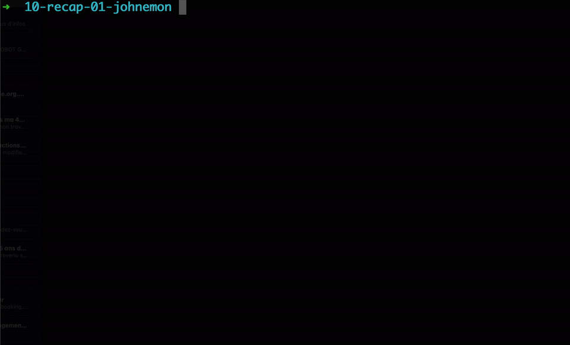
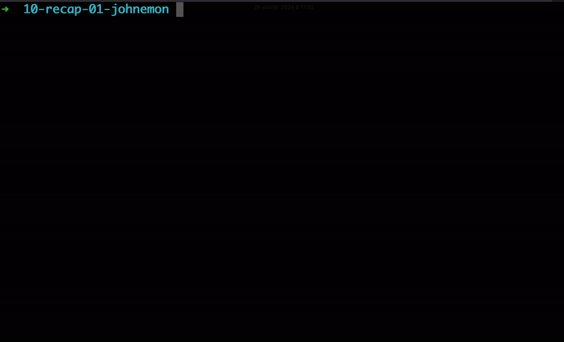

# JOHNEMON™™ Challenge

## Overview

Welcome to the Johnemon™ Challenge! In this challenge, you will be creating a simplified version of the classic Pokémon game, running in the terminal. Your task is to define a JavaScript class called "Johnemon™" with specific attributes and behaviors.

The Goal of this challenge is to provide you with a canvas for you to apply what we learned so far in the bootcamp.

It will serves are a way for you to practice your skills and to show me what you can do.

So, please go the extra mile and have fun!

## Part one, The Johnemon™ class.

In your coding adventures you will encounter many diferent JOHNEMON™S™. they will be your best friends and be able to fight for you!

### Class: Johnemon™

A Johnemon™ is a unique creature with the following attributes:

-   **Name:** Generated by combining two students' names randomly (provided in an array) EG => Nico & Diogo can create "Dico" or "Nigo".
-   **Level:** Starts at 1.
-   **Experience Meter:** Starts at 0.
-   **Attack Range:** Randomly generated between 1 and 8.
-   **Defense Range:** Randomly generated between 1 and 3.
-   **Health Pool:** Randomly generated between 10 and 30.
-   **Catch Phrase:** A unique string.

A Johnemon™ has the following behaviors:

-   **Attack:** A Johnemon™ can attack another Johnemon™. The damage done is a random number between the attacker's attack range times its current level and reduced by the defender's defense range. The defender's health pool is reduced by this amount.
-   **Gain Experience:** A Johnemon™ can gain experience. The experience meter is increased by a random number between 1 and 5 times the opposite Johnemon™'s level.
-   **Catch Phrase:** A Johnemon™ can say its catch phrase.
-   **Evolve:** When the experience level of a Johnemon™ equals its current level times 100, it can evolve. This increases its level by 1 and increases its attack range, defense range, and health pool by a random number between 1 and 5.

## Part Two, Become the ultimate Johnemon™ master!

### Class: Johnemon™Master

A Johnemon™Master is a person who has a collection of Johnemon™s. It has the following attributes:

-   **Name:** The name of the Johnemon™Master.
-   **Johnemon™ Collection:** An array of Johnemon™s.
-   **Healing Items**: a number of healing items.
-   **Revive Items**: a number of revive items.
-   **JOHNEBALLS**: a number of johneballs.

A Johnemon™Master has the following behaviors:

-   **Heal Johnemon™:** A Johnemon™Master can heal a Johnemon™ in its collection. This restores the Johnemon™'s health pool to its original value.
-   **Revive Johnemon™:** A Johnemon™Master can revive a Johnemon™ in its collection. This restores the Johnemon™'s health pool to its original value.
-   **Catch Johnemon™:** A Johnemon™Master can catch a Johnemon™. This adds the Johnemon™ to the Johnemon™Master's collection.
-   **Release Johnemon™:** A Johnemon™Master can release a Johnemon™ from its collection. This removes the Johnemon™ from the Johnemon™Master's collection.
-   **Show Collection:** The Johnemon™Master's collection is displayed in the console.

## Part Three, The Johnemon™ World!

### Class: Johnemon™World

A Johnemon™World is a place where Johnemon™Masters can battle each other. It has the following attributes:

-   **day:** the current day.
-   **logs:** an array of strings that represent the events of the day.

A Johnemon™World has the following behaviors:

-   **One Day Passes:** The day is increased by 1.
-   **addLog:** A string is added to the logs array. with the structure: "Day ${day}: ${log}". Each time that a console.log is showned to the user, it should also be saved in the logs

## Part Four, let's start the game.

Let's use the classes we created to start the game!
Our game will be only running in the console, so we will need to handle all the interactions with the user.

First, let's create a Johnemon™World.

then, let's create a Johnemon™Master. We will use the name of the user as a parameter.

The terminal will ask the user what's his name and create a Johnemon™Master with that name.

Then it will present the the User with Three random JOHNEMON™ and ask the user to choose it first JOHNEMON™.


After that the game will start, but before, let's create a save state so that we can quit and load the game.

## Part Four the **Save.json** file

We will generate a save.json file that will contain ourr data for each step of the way.

After the User chooses his first JOHNEMON™, the game will save the state in the save.json file.

under the following format:

```json
{
	"saved_on": "2020-04-29T15:52:00.000Z",
	"JohnemonMaster": {
		"name": "John",
		"johnemon™Collection": [
			{
				"name": "JohnJohn",
				"level": 1,
				"experienceMeter": 0,
				"attackRange": 6,
				"defenseRange": 2,
				"healthPool": 14,
				"catchPhrase": "I'm JohnJohn!"
			}
		],
		"healingItems": 0,
		"reviveItems": 0,
		"JOHNEBALLS": 0
	},
	"day": 1,
	"logs": ["JohnJohn has been added to your collection!"]
}
```




## Part Five, let's load the game.

When starting a new game by running the command

```bash
node Game.js
```

We want to be sure to be offered the possibility of loading a previous game.
If there is a save.json file, the game should ask the user if he wants to load it.
if the user says yes, the game should load the save.json file and start from where the user left off.
if the user says no, the game should start from the beginning.


## Part Six, A normal day in Johnemon™Town

We will add a new behavior to the One Day Passes method of the Johnemon™World class.
each day, different actions will take place.
First the Johnemon™Master will be asked what he wants to do.
The user will have the following options:

-   Heal Johnemon™ (use one healing item to heal one Johnemon™ to full health)
-   Revive Johnemon™ (use one revive item to revive one Johnemon™ to half health)
-   realease Johnemon™ (release one Johnemon™ from the collection)
-   rename Johnemon™ (rename one Johnemon™ in the collection)

After the user chooses an option, the game will ask the user to choose a Johnemon™ from his collection.

After that, the game will generate a random event that will take place. for now these events will be:

-   Nothing happens today, the day passes.
-   A wild Johnemon™ appears! (the user will be asked if he wants to fight it)

1. if nothing happens, the day passes saves the data and the one day passes method is called again.

2. If a wild Johnemon™ appears, the user will be asked if he wants to fight it. if he says yes, the game will generate a random Johnemon™ and start a fight.

## Part Seven, let's fight! Class: Johnemon™Arena

-   When A Johnemon™Master fights a wild Johnemon™, the game will create a Johnemon™Arena and start the fight. each fight will be divised in several rounds:

1. First the Wild Johnemon™ will introduce itself to the user by telling.

```
A wild level X, XXXXXXX Appears, it has XX Health
```

2. The user will be asked to choose a Johnemon™ from his collection to fight the wild Johnemon™.

3. Once the user chose a Johnemon™, the fight will start. Each round will be divised in two steps:

4. The Johnemon™Master will choose an action for his Johnemon™. the options are:
   a. Attack (the chosen Johnemon™ will perform an attack on the wild one)
   b. Try to catch (the master will try to catch the Johnemon™ using one of his JOHNEBALLS, to know if he catches it you need to calculate the probability, and the probality is relative to its health EG => A Johnson with 20% of health remaining will have 80% chance to be catched) - if the Johnemon™ is catched, the fight ends, if not, the wild Johnemon™ will attack the Johnemon™Master.
   c. Run away, it ends the fight.

5. The wild Johnemon™ will attack the Johnemon™Master's Johnemon™.

6. The round ends, and the game will check if the fight is over, if not, it will start a new round.

7. If the fight is over, the game will display the result of the fight, perform the gain experience action and save the data.


## Notes

1. I've provided you with a bunch of files and starter code, feel free to use it or not. You can change the names of files delete files, same for functions

2. There's no tests for this challenge, my goal is to see how far you can go using all that we have seen so far.

## Class Diagram of the game:


## Bonus

Please feel free to add as many feature you want: but if you need inspiration:

-   After a certain level a Johnemon™ evolve.
-   add more items to the game.
-   add more actions to the Johnemon™Master.
-   add more events to the Johnemon™World.
-   add more actions to the Johnemon™Arena.
-   add some music that runs when you play the game.
-   add some colors to the console.
-   add some images to the console.
-   add some animations to the console.
-   add some sound effects to the console
-   add multiple attacks to each Johnemon™.
-   add some special attacks to each Johnemon™.
-   add a rarity system to the Johnemon™.
